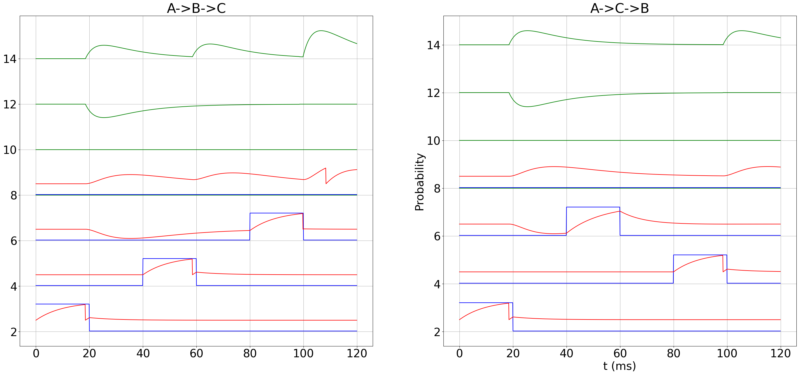

# Neuron-Sequence-Detector

Neuron spiking sequence detection through synaptic strength customisation.

In this case we want to elicit a spike when A->B->C only occurs. The neuron connectivity matrix will have to be modified to include inhibitory/exhibitory synaptic strengths to achieve the goal

